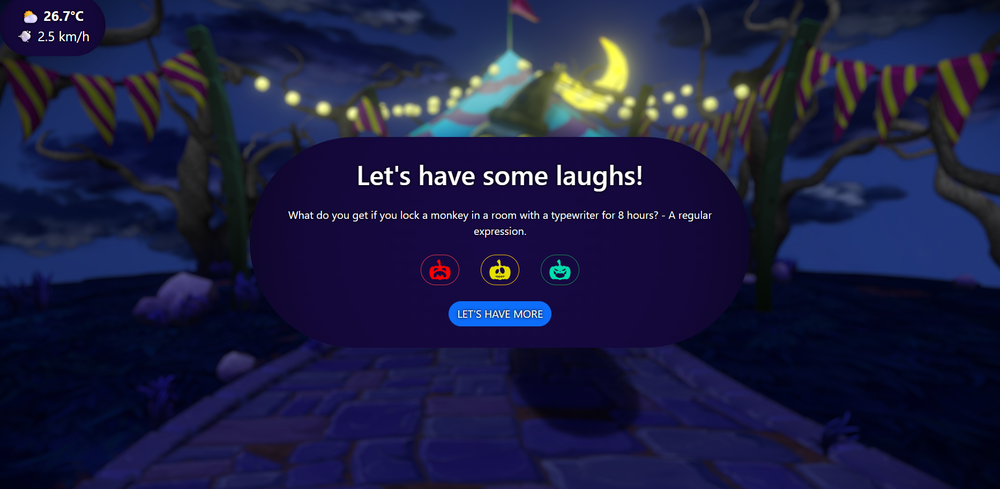

# 4.-API

## 📄 Descripción - Enunciado del ejercicio

Este proyecto es una aplicación web desarrollada con **TypeScript, HTML, CSS y Bootstrap**, que conecta con APIs externas para mostrar chistes aleatorios y la información meteorológica actual de Barcelona.

La aplicación debía cumplir con:

- Obtener datos de al menos **dos APIs diferentes**.
- Mostrar la información de manera clara en el navegador.
- Permitir interacción con el usuario (botones, puntuaciones, etc.).
- Incluir **testing** con Jest.

---

## ✨ Funcionalidades

- **Chistes dinámicos** 🎭:

  - Obtención de chistes desde la API [JokeAPI](https://jokeapi.dev/).
  - Categorías utilizadas: _Programming_ y _Spooky_.
  - Posibilidad de puntuar cada chiste con un valor de **1, 2 o 3**.
  - Registro en memoria de los chistes puntuados (`reportJokes`).

- **Meteorología en tiempo real** ⛅:
  - Consulta a la API [Open-Meteo](https://open-meteo.com/).
  - Información sobre **temperatura**, **velocidad del viento** y un **icono representativo** según el código del tiempo.

---

## 💻 Tecnologías Utilitzadas

- **HTML5**
- **CSS3** + [Bootstrap](https://getbootstrap.com/)
- **TypeScript**
- **Jest** (para testing)
- **APIs externas**:
  - [JokeAPI](https://jokeapi.dev/)
  - [Open-Meteo](https://open-meteo.com/)

---

## 📋 Requisitos

Para ejectuar este proyecto, se necesita:

- Un entorno con Node.js instalado, recomendado v18 o superior.
- Un editor de código (recomendado: Visual Studio Code).
- Terminal o consola para ejecutar comandos npm.

---

## 🛠️ Instalación

1. Clona el repositorio o descarga los archivos ZIP.
2. Abre la carpeta en tu editor de código.
3. Instala las dependencias ejecutando: `npm install`

---

## ▶️ Ejecución

- **Ejecución visual del proyecto**:

1. Compila el archivo **index.ts** desde el terminal con el comando: `npx tsc --watch`.
2. Abre el archivo **index.html** en el navegador.
3. Pulsa el botón "Nuevo Chiste" para mostrar uno aleatorio y puntuarlo.
4. Mira en la parte superior izquierda la información meteorológica de Barcelona.

- **Testing**:

1. Ejecuta los tests con el siguiente comando: `npm test` desde la ventana del terminal de tu editor de código.
2. Si todos los tests pasan, ¡Todo es correcto y funcional! Sientete libre de cambiar los valores por codigo para hacer diferentes tests.

---

## 🖼️ Demo

A continuación puedes ver algunas capturas de la aplicación en funcionamiento:

- Pantalla principal de la aplicación.

  

- Muestra del funcionamiento de chistes y puntuación.

  

---

## 👤 Autor

- [Alex Gesti Fernández](https://github.com/alexgesti)
